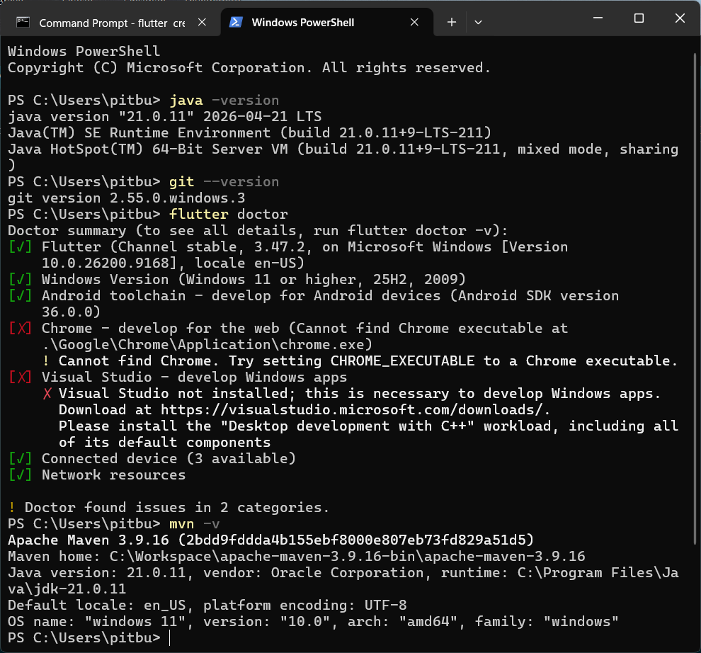
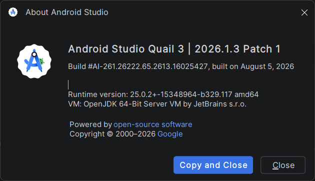
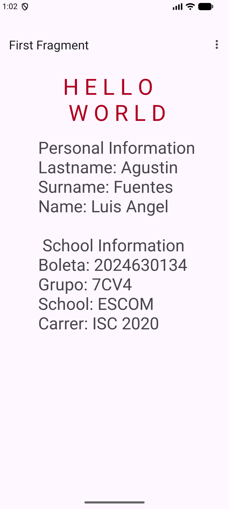
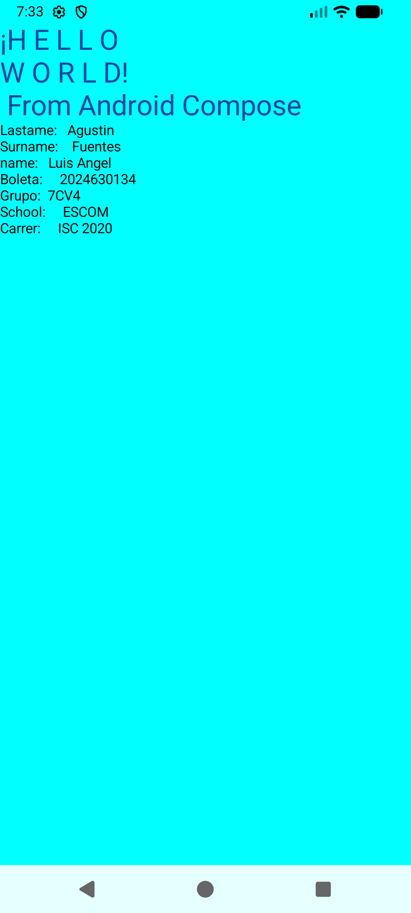
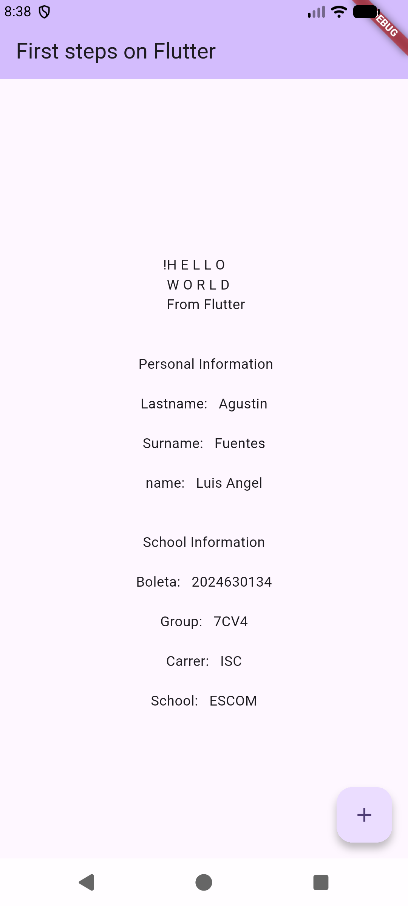

# practica01_Android_Studio


# Practice 1: Desarrollo de Aplicación "Hola Mundo" en Tres Enfoques Móviles

**School:** Escuela Superior de Cómputo (ESCOM)  
**Subject:** Desarrollo de Aplicaciones Moviles Nativas  
**Group:** 7CV4  
**Student:** Luis Angel Agustin Fuentes  
**Boleta:** 2024630134  

---

##  Summary

This repository containt the implementation of a Basic Mobile App built across three distintc Android Dev. Architectures. 
The main of this practice is to evaluate the paradigmatic differentes. UI component managment, and the developer xp across native and cross-platform/declarative approches.

### Tools used
* **Android Studio:** main IDE used for emulation, compilation and programming.
* **Java Development Kit (JDK 17/21):** Runtime enviroment and build tools for Gradle and Android
* **Flutter SDK:** multiplattform Framework used for programming on Dart
* **Git & GitHub:** Version controller system used by upload the three projects into a repository

### Developed projects
1. **`Android_XML/`**: Android Navite App based on Basic Views Activities ussing XML tags defined.
2. **`Android_COMPOSE/`**: Android Native App based on Jetpack Compose ussing Kotlin.
3. **`Android_FLUTTER/`**: Mobile App built by Flutter and Dart.

---

## Environment & tool verification

### Installed tool versions
* **Git:** `2.55.0`
* **Java (JDK):**  `21.0.11`
* **Flutter SDK:** `3.47.2`
* **Maven:** `3.9.16`
* **Android Studio:** Android Studio Quail 3 | 2023.1.3 Patch 1




---

## Installation guide

### Prerrequisites
1. Clone the public repository:
   ```bash
   git clone [https://github.com/luisAgt/practica01_Android_Studio.git](https://github.com/luisAgt/practica01_Android_Studio.git)
   cd practica01_Android_Studio
2. Launch the Android Emulator or via terminal:
    ```bash
    emulator -avd <Your_AVD_name>
### 3. Run the project

#### 3.1. Running Android XML Version
a. Open Android Studio and select the `Android_XML` folder.  
b. Sync the project with Gradle files.  
c. Select the emulated device in the top bar and click **Run**.  



#### 3.2. Running Android Compose Version
a. Open Android Studio and select the `Android_COMPOSE` folder.  
b. Ensure `build.gradle` is configured with the matching Kotlin/Compose compiler version.  
c. Run the app by clicking **Run** in the top bar.  



#### 3.3. Running Android Flutter Version
a. Open Command Prompt or CMD, then navigate to the project directory:

```bash 
cd Android_FLUTTER
```
b. Retrieve project dependencies:

```bash
flutter pub get
```
c. run the app targeting the active Android Emulator.

```bash
flutter run -d emulator-5554
```
